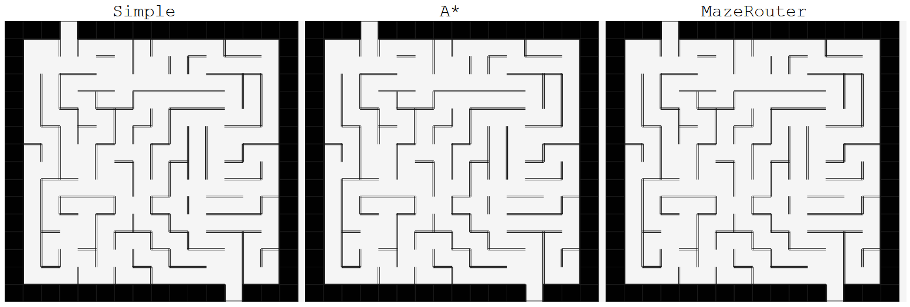

# MazeGenerator with Pathfinding algorithms
A visualisation of a maze generator with 3 different pathfinding algorithms to solve the maze using javascript and p5.

Try it out here: https://alliballibaba.github.io/MazeGenerator-and-Pathfinder/

## The Maze Generator
The maze generator is an implementation of the **Depth-first Search** algorithm. The alorithm guarantuees, 
that every cell of the maze is accessible and that there is just a single path to the ending. To create multiple
paths to the ending, walls are removed within the maze at random spots.

## The Simple Pathfinder
The simple pathfinder randomly checks all available paths at the same time until it reaches the end. This method is 
quite inefficient, especially on big mazes. It often manages to find a shorter path to the goal than the other two
algorythms, since more cells are explored.

## The A* Pathfinder
My interpretation of an A* pathfinding algorithm. Adjacent nodes are stored in a sorted list. The nodes with the lowest 
f-value are explored first, where the f-value is simply the sum of the path length from the start to the node and the distance 
from the node to the goal.

## The Maze Router Pathfinder
The Maze Router most resembles an actual person trying to traverse the maze. At every intersection choose the path
with the smallest distance to the goal. Paths in the maze are explored until a dead end is hit. When a dead end is
hit, return to the intersection closest to the goal. This algorythm can be faster than A* in a few cases, but will
usually require more steps to finish the maze.

